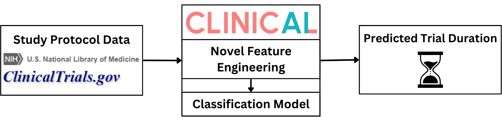
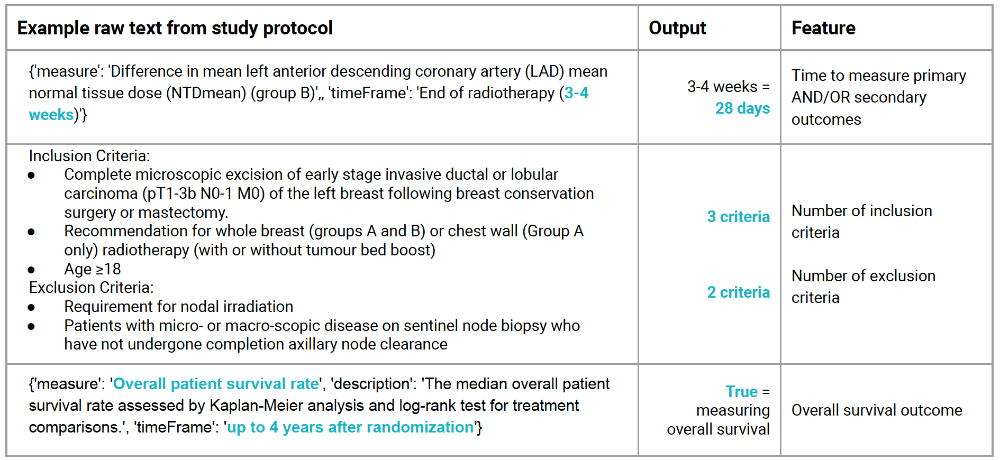

## Problem & Motivation


Within the pharmaceutical industry, clinical trials are essential for the delivery of new drugs or treatment to patients. At minimum, a novel drug has to undergo 3 phases of study in order to receive FDA approval. The logistical complexity and long durations of these trials create critical bottlenecks in the healthcare innovation pipeline. Providing a non-subjective and non-empirical insight for trial duration has the potential to increase chances of trial success. Despite a global market valuation of $55.86 billion in clinical research services, there is a crucial lack of robust, publicly accessible tools for predicting trial durations. 

We propose a machine learning framework with novel feature engineering wrapped in a convenient and accessible web API to predict a duration interval of clinical trials. This tool aims to serve Clinical Research Organizations (CROs), pharmaceutical companies, and researchers. By entering their preliminary study parameters, the API will provide them with accurate predictions that can aid in better resource management, budgeting, and strategic planning.

## Data & ML Approach


Our data is from ClinicalTrials.gov, a prominent global and open source registry for clinical research studies. Our project utilizes 19,049 oncology studies:

* 5,053 Phase 1 studies
* 5,982 Phase 2 studies
* 1,634 Phase 3 studies

Study protocol data includes information on study locations, number of patients enrolled, disease types, and outcome measurement methods. We were able to extract novel features relevant to trial duration from the text heavy data fields of study protocols through a combination of looking for string and regex patterns. These text fields are highly variable in structure and formatting because they are human-written, extraction to create novel features was a signficant challenge, see the table below for examples of extracted data.



Given previous work in this space, we focused on the best performing traditional machine learning models: RandomForest, XGBoost, and LightGBM. We performed binary classification with the selected models by splitting all trial durations by median trial duration and predicting whether an oncology trial’s duration will take longer than the median trial length or shorter. We evaluated the performance of our classification models with the standard metrics of accuracy, precision, recall, F1-score, and area under the curve of the receiver operating characteristic (ROC-AUC).

Our model, ClinicalAI, outperforms the baseline, Long, et al.'s model, with a higher test accuracy and ROC AUC. This indicates that ClinicalAI is far better at distinguishing positive classes (oncology trials taking longer than the median trial length) from negative classes (trials taking shorter than the median trial length). ClinicalAI also has a far better precision and recall, meaning that most trials that are predicted as taking longer than the median are accurate, which would be crucial for logistical and budget planning.

| Model | Model Type | Phase | Trial Cancer Type | Accuracy | Precision | Recall | F1 Score | ROC AUC|
|---------|---------|---------|---------|---------|---------|---------|---------|---------|
| Long   | RandomForest   | Phase 1   | Lymphoma | 0.672 | 0.665 | 0.672 | 0.657 | 0.716 |
| Long   | RandomForest   | Phase 1   | Onocology | 0.710 | 0.709 | 0.710 | 0.708 | 0.783 |
| ClinicalAI | RandomForest   | Phase 1   | Lymphoma | 0.654 | 0.656 | 0.654 | 0.654 | 0.739 |
| ClinicalAI | RandomForest   | Phase 1   | Oncology | 0.750 | 0.750 | 0.750 | 0.750 | 0.836 |
| ClinicalAI | RandomForest   | Phase 2   | Oncology | 0.722 | 0.722 | 0.722 | 0.722 | 0.795 |
| ClinicalAI | RandomForest   | Phase 3   | Oncology | 0.745 | 0.746 | 0.745 | 0.745 | 0.825 |

## Key Learnings
> **Our novel engineered features were able to improve predictive performance over the current published state-of-the-art.**

We have shown the significance of extracting duration relevant features from human written study protocol data. Including features estimating measurement cycles for primary and secondary outcomes, number of inclusion and exclusion criteria, and 5-year survival rate by cancer type have shown marked improvement in predictive performance and greater generalizability over previously published work. We were able to achieve an accuracy of 0.750 for Phase 1 general oncology trials with ClinicalAI, where the previous benchmark was an accuracy of 0.725 specifically for Phase 1 lymphoma trials. 

> **Study protocol data alone is not sufficiently granular for high accuracy predictions of trial duration.**

Our original intention was to use regression models to predict trial duration rather than a binned time interval. However, we found that this dataset has very high variance in trial duration due to the nature of oncology studies, e.g. adverse events, such as patient death, would extend recruitment and trial times. We attempted to infer data such as time spent on participant recruitment from features like number of criteria and adverse events that would affect recruitment and trial time, such as patient death, that are not captured in protocol data. However, this was not sufficient for regression modeling.

> **Using large language models (LLMs) for feature extraction is difficult and a nontrivial task with jargon-heavy text.**

We have shown the significance of extracting features from protocol text, but our current methods are with hard coding. We did attempt to use LLMs for feature extraction, but experienced considerable difficulty with getting consistent and accurate extractions. We theorize this is maybe because of the specific medical jargon being used. Although we attempted to use a Named Entity Recognition (NER) model trained on biomedical text, we were still unable to get good extractions. Further time and investment is required to explore using LLMs for feature extraction in this context.


## Web Application MVP
Our web API predicts a time interval based on information from the study protocol for oncology trials. Some examples of study information include:
- number of enrolled participants
- number of participant exclusion criteria
- disease category
- number of study sites
- etc.

See ```/trial_app/README.md``` for full instructions on how to build and launch the app.

Our MVP uses a Random Forest Classifier trained on publicly available data from ClinicalTrials.gov.

See ```/model/README.md``` for details on model training.  
See ```/data/README.md``` for full details on data and feature engineering.

## References
Long, B., Lai, S. W., Wu, J., & Bellur, S. (2023). Predicting Phase 1 Lymphoma Clinical Trial Durations Using Machine Learning: An In-Depth Analysis and Broad Application Insights. Clinics and Practice, 14(1), 69-88.

Hutchison, E., Zhang, Y., Nampally, S., Neelufer, I. K., Malkov, V., Weatherall, J., ... & Shameer, K. (2021). Modeling Clinical Trial Attrition Using Machine Intelligence: A driver analytics case study using 1,325 trials representing one million patients. medRxiv, 2021-11.

Kavalci, E., & Hartshorn, A. (2023). Improving clinical trial design using interpretable machine learning based prediction of early trial termination. Scientific reports, 13(1), 121.

Wu, K., Wu, E., DAndrea, M., Chitale, N., Lim, M., Dabrowski, M., ... & Zou, J. (2022). Machine learning prediction of clinical trial operational efficiency. The AAPS Journal, 24(3), 57.

Markey, N., Howitt, B., El-Mansouri, I., Schwartzenberg, C., Kotova, O., & Meier, C. (2024). Clinical trials are becoming more complex: a machine learning analysis of data from over 16,000 trials. Scientific Reports, 14(1), 3514.